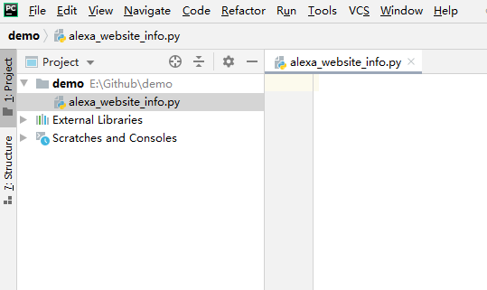
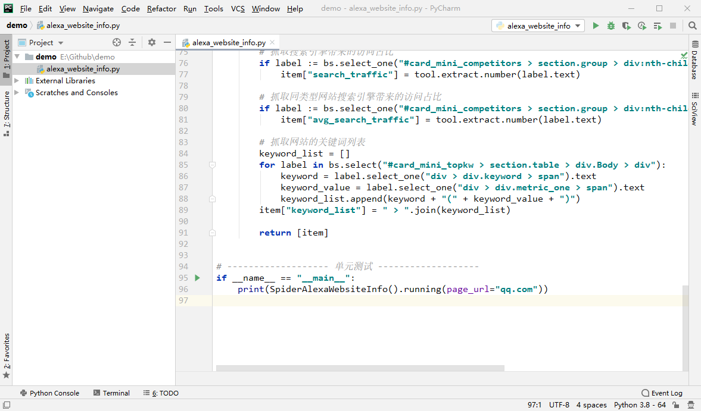
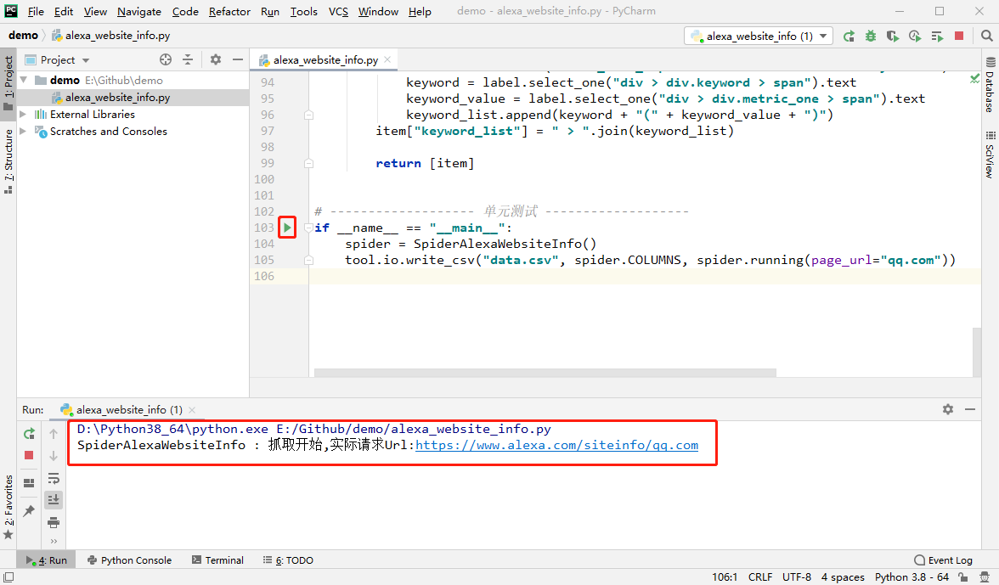
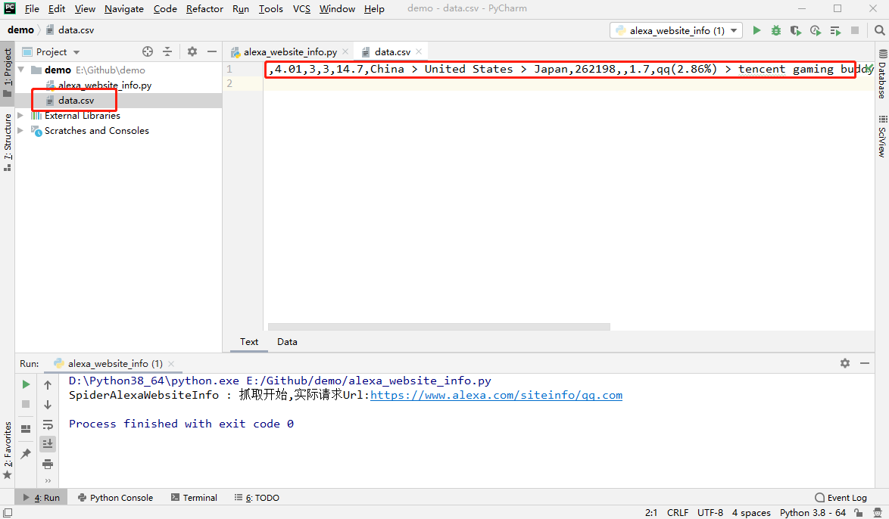

# Alexa网站信息爬虫文档

> 最新有效性检查时间：2020.12.28

**爬虫类型**：单次运行爬虫

**爬虫依赖第三方模块**：crawlertool、bs4

**爬虫功能**：Alexa网站信息爬虫

爬虫逻辑为直接请求Alexa的包含指定网站数据的页面以获取数据；Alexa对于浏览量较小的网站，仅收录部分数据，因此对于这些我们网站我们也仅能采集到部分数据。

**爬虫参数**：

| 参数名   | 参数功能                                     |
| -------- | -------------------------------------------- |
| page_url | 目标网站的地址，应为一级域名（形如：qq.com） |

**爬虫返回结果数据**：

| 字段名             | 字段内容                         |
| ------------------ | -------------------------------- |
| alexa_rank         | 网站的Alexa排名                  |
| pageviews          | 访客日均浏览页面数               |
| daily_time         | 访客日均浏览时间                 |
| bounce_rate        | 跳出率                           |
| avg_bounce_rate    | 同类网站平均跳出率               |
| country_list       | 访客地理分布                     |
| links              | 外链数                           |
| search_traffic     | 搜索引擎带来的访问占比           |
| avg_search_traffic | 同类型网站搜索引擎带来的访问占比 |
| keyword_list       | 网站的关键词列表                 |

**创建时间**：2018+

**修改时间**：2020.10.23

-----

> 以下教程适合于对没有使用过Python的使用者，熟悉Python的使用者阅读[合集通用的爬虫使用说明](https://github.com/ChangxingJiang/CxSpider#%E4%BA%8C%E7%88%AC%E8%99%AB%E4%BD%BF%E7%94%A8%E8%AF%B4%E6%98%8E)即可。

## 快速上手教程

#### 第1步：检查Python环境

检查本地是否已经安装Python环境，如果没有安装Python环境则安装Python环境【[Python环境安装教程](https://dataartist.blog.csdn.net/article/details/88278970)】，要求Python版本≥3.8；建议同时安装一个Python的IDE（[PyCharm的免费社区版](https://www.jetbrains.com/pycharm/)即可）。

#### 第2步：安装爬虫依赖第三方模块

这个爬虫依赖crawlertool模块和bs4模块，在命令提示符中使用pip安装这两个模块即可。

* 安装crawlertool模块的命令：`pip install crawlertool`
* 安装bs4模块的命令：`pip install bs4`

> 命令执行后命令提示符打印`Requirement already satisfied`（已安装过）或`Successfully installed crawlertool-0.1.21`（已安装成功），则说明安装完成。

#### 第3步：创建一个新的Python脚本

如果没有创建PyCharm项目（工程）的话，需要创建一个新的Python项目（工程）【[PyCharm创建工程教程](https://blog.csdn.net/xinghuanmeiying/article/details/79409011)】。

在PyCharm项目中的任意位置创建一个空的Python脚本（.py文件）。

> 创建方法：File -> New -> Python File



#### 第4步：将爬虫类的源代码粘贴到新建的Python脚本中

将CxSpider项目中Alexa网站信息爬虫的源代码完整地粘贴到新建的Python脚本中（包括其中的单元测试部分）。

源代码：https://github.com/ChangxingJiang/CxSpider/blob/master/spider/Alexa_Website_Info/Alexa_Website_Info.py



#### 第5步：处理爬虫返回的结果数据

Alexa网站信息爬虫是继承自抽象基类`SingleSpider`的单次运行的爬虫，调用爬虫类的`running`方法后，`running`方法会将爬虫返回的结果数据作为返回值返回。爬虫返回的结果数据格式为列表字典（`List[Dict]`）。

下面我们分别尝试将爬虫返回的结果数据存储到csv文件和MySQL数据库。

**将数据存储到csv文件**

```python
if __name__ == "__main__":
    spider = SpiderAlexaWebsiteInfo()
    tool.io.write_csv("data.csv", spider.COLUMNS, spider.running(page_url="qq.com"))
```

为将数据存储到csv文件，故将单元测试部分的代码修改如上。

爬虫运行后会将结果数据写入到Python脚本（.py文件）所在文件夹的data.csv文件中（如果这个文件不存在则会创建它）。

**将数据存储到MySQL数据库**

```python
if __name__ == "__main__":
    mysql = tool.db.MySQL(host="",  # 填写数据库的HOST
                          database="",  # 填写数据库的数据库名称
                          user="",  # 填写数据库的账号名称
                          password="")
    spider = SpiderAlexaWebsiteInfo()
    mysql.insert(table="alexa", data=spider.running(page_url="qq.com"))
```

为将数据存储到MySQL数据库，故将单元测试部分的代码修改如上，并将你的数据库HOST、数据库名称、账号名称、账号密码等信息填写对对应的位置。

爬虫运行后会将结果数据写入到指定数据库中的名称alexa的数据表中（如果这个数据表不存在则会创建它）。

#### 第6步：运行爬虫



点击图中圈出的绿色三角，即可运行当前Python脚本启动爬虫；运行中可以下方圈出的控制台查看运行进度。

在运行结束后，我们可以查看采集的结果数据。例如当我们将数据存储在csv文件中时，可以打开目录中出现的data.csv文件，查看其中的数据（也可以使用Excel打开csv文件查看采集结果）。



