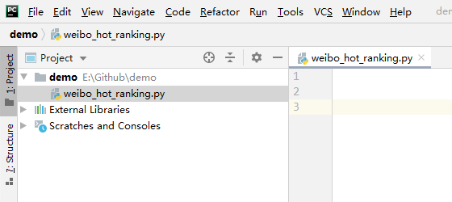
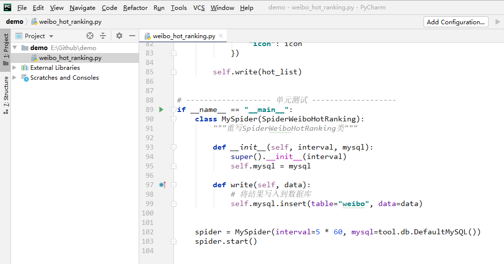
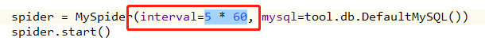
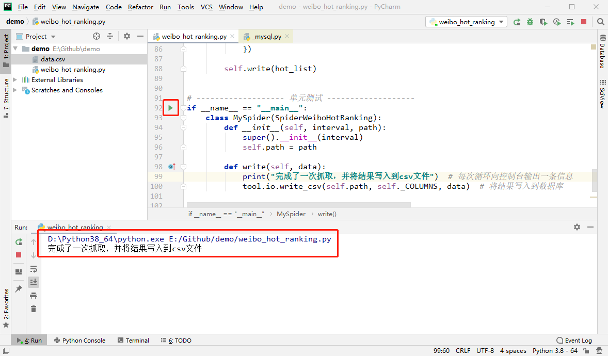
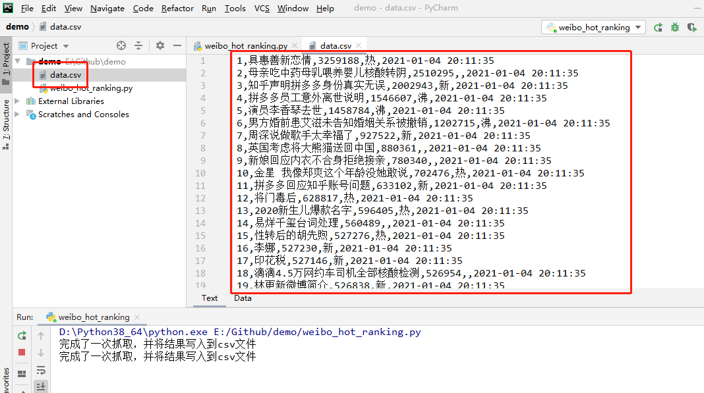

# 微博热搜榜爬虫文档

> 最新有效性检查时间：2020.12.28

**爬虫类型**：循环运行爬虫

**爬虫依赖第三方模块**：crawlertool、bs4

**爬虫功能**：循环采集微博热搜榜数据，并自动忽略固定第1条的置顶热搜和标注为“推荐”的广告热搜

**爬虫参数**：

| 参数名  | 参数功能                                   |
| ------- | ------------------------------------------ |
| ranking | 热搜排名（热搜序号，剔除广告热搜后的排名） |

**爬虫返回结果数据**：

| 字段名  | 字段内容                                   |
| ------- | ------------------------------------------ |
| ranking | 热搜排名（热搜序号，剔除广告热搜后的排名） |
| keyword | 热搜关键词                                 |
| heat    | 热搜热度                                   |
| icon    | 热搜标志（热、沸、新）                     |
| time    | 采集时间                                   |

**创建时间**：2020.05.29

**修改时间**：2021.01.04

-----

> 以下教程适合于对没有使用过Python的使用者，熟悉Python的使用者阅读[合集通用的爬虫使用说明](https://github.com/ChangxingJiang/CxSpider#%E4%BA%8C%E7%88%AC%E8%99%AB%E4%BD%BF%E7%94%A8%E8%AF%B4%E6%98%8E)即可。

## 快速上手教程

#### 第1步：检查Python环境

检查本地是否已经安装Python环境，如果没有安装Python环境则安装Python环境【[Python环境安装教程](https://dataartist.blog.csdn.net/article/details/88278970)】，要求Python版本≥3.8；建议同时安装一个Python的IDE（[PyCharm的免费社区版](https://www.jetbrains.com/pycharm/)即可）。

#### 第2步：安装爬虫依赖第三方模块

这个爬虫依赖crawlertool模块和bs4模块，在命令提示符中使用pip安装这两个模块即可。

* 安装crawlertool模块的命令：`pip install crawlertool`
* 安装bs4模块的命令：`pip install bs4`

> 命令执行后命令提示符打印`Requirement already satisfied`（已安装过）或`Successfully installed crawlertool-0.1.21`（已安装成功），则说明安装完成。

#### 第3步：创建一个新的Python脚本

如果没有创建PyCharm项目（工程）的话，需要创建一个新的Python项目（工程）【[PyCharm创建工程教程](https://blog.csdn.net/xinghuanmeiying/article/details/79409011)】。

在PyCharm项目中的任意位置创建一个空的Python脚本（.py文件）。

> 创建方法：File -> New -> Python File



#### 第4步：将爬虫类的源代码粘贴到新建的Python脚本中

将CxSpider项目中微博热搜榜爬虫的源代码完整地粘贴到新建的Python脚本中（包括其中的单元测试部分）。

源代码：https://github.com/ChangxingJiang/CxSpider/blob/master/spider/Weibo_Hot_Ranking/Weibo_Hot_Ranking.py



#### 第5步：设置爬虫每次循环之间的间隔时间



在上图位置，可以设置爬虫每次循环之间的间隔时间，其单位为秒。通常建议设置在1分钟以上，从而避免请求过于频繁。

#### 第6步：处理爬虫返回的结果数据

微博热搜榜爬虫是继承自抽象基类`LoopSpider`的循环运行的爬虫，在每次循环中，爬虫均会调用`write`方法，并将爬虫的结果数据作为参数提供给`write`方法。因此，我们需要通过重写`write`方法，来实现对爬虫返回的结果数据的处理。爬虫返回的结果数据格式为列表字典（`List[Dict]`）。

我们可以通过在`write`方法中增加控制台输出，以了解当前爬虫是否仍在正常循环运行。

下面我们分别尝试将爬虫返回的结果数据存储到csv文件和MySQL数据库。

**将数据存储到csv文件**

```python
if __name__ == "__main__":
    class MySpider(SpiderWeiboHotRanking):
        def __init__(self, interval, path):
            super().__init__(interval)
            self.path = path

        def write(self, data):
            print("完成了一次抓取，并将结果写入到csv文件")  # 每次循环向控制台输出一条信息
            tool.io.write_csv(self.path, self._COLUMNS, data)  # 将结果写入到csv文件

    spider = MySpider(interval=5 * 60, path="data.csv")
    spider.start()
```

为将数据存储到csv文件，故将单元测试部分的代码修改如上。我们将`write`方法重写为将数据写入到csv文件中，并将csv文件的路径作为构造函数的参数，存储于爬虫类的属性中。

爬虫运行时，每次循环都会将新获取的数据写入到Python脚本（.py文件）所在文件夹的data.csv文件中（如果这个文件不存在则会创建它）。

**将数据存储到MySQL数据库**

```python
if __name__ == "__main__":
    class MySpider(SpiderWeiboHotRanking):
        def __init__(self, interval, mysql):
            super().__init__(interval)
            self.mysql = mysql

        def write(self, data):
            print("完成了一次抓取，并将结果写入到MySQL数据库")  # 每次循环向控制台输出一条信息
            self.mysql.insert(table="weibo", data=data)  # 将结果写入到数据库

    spider = MySpider(interval=5 * 60, mysql=tool.db.MySQL(host="",  # 填写数据库的HOST
                                                           database="",  # 填写数据库的数据库名称
                                                           user="",  # 填写数据库的账号名称
                                                           password=""))  # 填写数据库的账号密码
    spider.start()
```

为将数据存储到MySQL数据库，故将单元测试部分的代码修改如上，并将你的数据库HOST、数据库名称、账号名称、账号密码等信息填写对对应的位置。我们将`write`方法重写为将数据写入到MySQL数据库中，并将MySQL数据库链接对象作为构造函数的参数，存储于爬虫类的属性中。

爬虫运行时，每次循环都会将新获取的数据写入到指定数据库中的名称weibo的数据表中（如果这个数据表不存在则会创建它）。

#### 第7步：运行爬虫



点击图中圈出的绿色三角，即可运行当前Python脚本启动爬虫。每次循环都会在下方圈出的控制台中，输出一条提示信息；当我们不希望爬虫继续运行时，可以点击控制台左侧的红色方块，停止爬虫的运行。

在运行中，我们随时可以查看已经采集的数据。例如当我们将数据存储在csv文件中时，可以打开目录中出现的data.csv文件，查看其中的数据（也可以使用Excel打开csv文件查看采集结果）。



